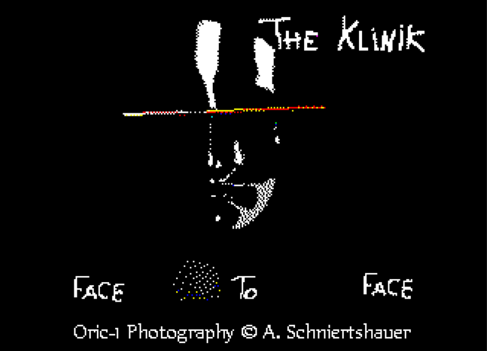

# Oric-Atmos-Mist-48K

## Repository Content

Files for the MIST FPGA Computer with Oric Atmos 48k core - tested with [Oric_mist-2.1-edsk.zip](https://github.com/rampa069/Oric_Mist_48K/releases/download/V2.1-EDSK/Oric_mist-2.1-edsk.zip).

| Filename (CPC DSK file) | Description                                                  |
| ---------------------------- | ------------------------------------------------------------ |
| LOTHRINGAIR_CPC.dsk          | SEDORIC V3.0 Lothringair I-IV disk with 18 files Photography shot at Lothringair I-IV street festivals in Aachen, Germany in the years 2014, 2015, 2016 and 2017 |
| CLAUDIO_CPC.dsk              | SEDORIC V3.0 Claudio disk with 9 files Repaintings of LP Cover by Claudio with Commodore Amiga ~1988, converted to Oric-1 / Atmos in 2015 by Andreas DMBLACK.COM: Depeche Mode - Black Celebration, EISBAER.COM: Grauzone - Eisbär, FACE.COM: The Klinik - Face to Face, FRONT242.COM: Front242 - Geography, KISSME.COM: The Cure - Kiss Me Kiss Me Kiss Me, SISTERS.COM: Sisters of Mercy - Floodland, SUSI.COM: Siouxsie & The Banshees - A Dazzle, TCTOP.COM: The Cure - The Top, XX.COM: Siglo XX - Antler Tracks I |

### How to view the photography on the MIST FPGA computer:

1. Download the files and prepare SD-Card as described in the [Oric_Mist_48K](https://github.com/rampa069/Oric_Mist_48K) repository.

2. Download the file(s) from this repository.

3. Copy the `dskcpc` folder to the prepared SD-Card.

4. Boot your MIST from the SD-Card and press `F12` to enter the `OSD Main Menu`.

5. In OSD enable `Oric Atmos` ROM and set `FDD controller` to `ON` (this has to be done only once).

6. In OSD select `Mount Drive A:*.dsk` and select a file from the `dskcpc` folder.

7. Press `F11`  (Reset) to reboot the system, you should see  a `SEDORIC V3.0` screen with a bunch of files, e.g. if you selected `LOTHRINGAIR_CPC.dsk` you should see e.g. `MIC.COM 8P`.

8. At the  prompt enter `LOAD"MIC"` and press the `ENTER` key to load the `MIC.COM` file.

9. You should see a photography 

   that I shot at Lothringair street festival in Aachen, Germany.

10. Press `F11` to reboot into the `SEDORIC` screen and load another file.

    

## CLAUDIO_CPC.dsk : THE KLINIK - FACE To FACE

